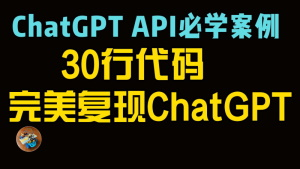

# ChatGPT API Example (Model: gpt-3.5-turbo)

## 实战案例：复现OpenAI ChatGPT功能代码： myChatGPT.ipynb（Google colab平台）

代码制作介绍（Youtube视频）：Colab平台ChatGPT API实战教程，从入门到进阶

相关链接：

OpenAI ChatGPT API Rrelease Announcements (2023.3.1): 
https://openai.com/blog/introducing-chatgpt-and-whisper-apis

Google colab: https://colab.research.google.com/

OpenAI API Login: https://openai.com/api/login/

头像图标： https://lets-emoji.com/emojilist/emojilist-22/
